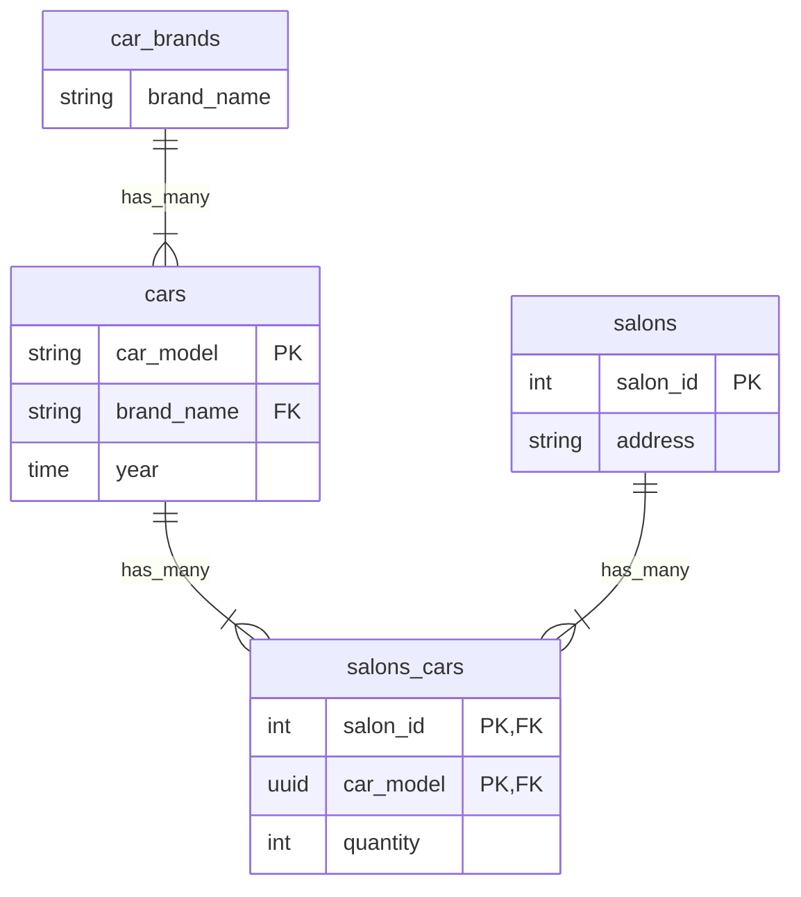

```mermaid
erDiagram
  salons {
    int salon_id PK
    string address
  }

  car_brands {
    string brand_name
  }

  cars {
    string car_model PK
    string brand_name FK
    time year
  }

  salons_cars {
    int salon_id PK,FK
    uuid car_model PK,FK
    int quantity
  }

  car_brands ||--|{ cars: has_many
  cars ||--|{ salons_cars: has_many
  salons ||--|{ salons_cars: has_many
```