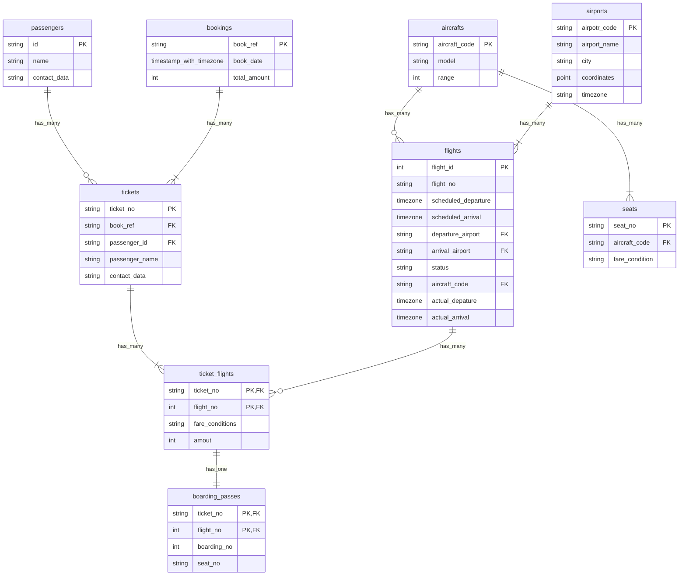

```mermaid
erDiagram
  bookings {
    string book_ref PK
    timestamp_with_timezone book_date
    int total_amount
  }

  tickets {
    string ticket_no PK
    string book_ref FK
    string passenger_id FK
    string passenger_name
    string contact_data
    
  }

  passengers {
    string id PK
    string name
    string contact_data
  }

  ticket_flights {
    string ticket_no PK, FK
    int flight_no PK, FK
    string fare_conditions
    int amout
  }

  boarding_passes {
    string ticket_no PK, FK
    int flight_no PK, FK
    int boarding_no
    string seat_no
  }

  airports {
    string airpotr_code PK
    string airport_name
    string city
    point coordinates
    string timezone
  }

  flights {
    int flight_id PK
    string flight_no
    timezone scheduled_departure
    timezone scheduled_arrival
    string departure_airport FK
    string arrival_airport FK
    string status
    string aircraft_code FK
    timezone actual_depature
    timezone actual_arrival
  }

  aircrafts {
    string aircraft_code PK
    string model
    int range
  }

  seats {
    string seat_no PK
    string aircraft_code FK
    string fare_condition
  }

  airports ||--|{ flights: has_many
  flights ||--o{ ticket_flights: has_many
  aircrafts || --|{ seats: has_many
  aircrafts ||--o{ flights: has_many

  bookings ||--|{ tickets: has_many
  tickets ||--|{ ticket_flights: has_many
  ticket_flights ||--|| boarding_passes: has_one

  passengers ||--o{ tickets: has_many

```
