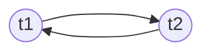

# Шауэрман Айнур

## Домашнее задание №5

Глава 6 6.1, 6.2, 6.3, 6.4, 6.5,6,6 6.7

### Упражнение 6.1

Начните транзакцию (командой BEGIN) и создайте новое бронирование в таблице bookings сегодняшней датой. Добавьте два электронных билета в таблицу tickets, связанных с созданным бронированием.
Представьте, что пользователь не подтвердил бронирование и все введенные данные необходимо отменить. Выполните отмену транзакции и проверьте, что никакой добавленной вами информации действительно не осталось.

**Ответ**:

```sql
> BEGIN;
BEGIN

> INSERT INTO bookings (book_ref, book_date, total_amount) VALUES ('000000', current_timestamp, 55800);
INSERT 0 1

> SELECT * FROM bookings WHERE book_ref='000000';
 book_ref |           book_date           | total_amount 
----------+-------------------------------+--------------
 000000   | 2023-11-11 08:26:13.774329+00 |     55800.00
(1 row)

> INSERT INTO tickets (ticket_no, book_ref, passenger_id, passenger_name, contact_data) VALUES ('1111111111111','000000', '0000 111111', 'John Doe', '{"address": "baker st. 56"}');
INSERT 0 1

> INSERT INTO tickets (ticket_no, book_ref, passenger_id, passenger_name, contact_data) VALUES ('2222222222222','000000', '1111 222222', 'Natalie Doe', '{"address": "baker st. 56"}');
INSERT 0 1

> ROLLBACK;
ROLLBACK

> SELECT * FROM bookings WHERE book_ref='000000';
 book_ref | book_date | total_amount 
----------+-----------+--------------
(0 rows)

> SELECT * FROM tickets WHERE book_ref='000000';
 ticket_no | book_ref | passenger_id | passenger_name | contact_data 
-----------+----------+--------------+----------------+--------------
(0 rows)

```

### Упражнение 6.2

Теперь представьте сценарий, в котором нужно отменить не все данные, а только последний из добавленных электронных билетов.
Для этого повторите все действия из предыдущего упражнения, но перед
добавлением каждого билета создавайте точку сохранения (с одним и тем
же именем). После ввода второго билета выполните откат к точке сохра-
нения. Проверьте, что бронирование и первый билет остались.

**Ответ:**

```sql
> BEGIN;
BEGIN

> INSERT INTO bookings (book_ref, book_date, total_amount) VALUES ('000000', current_timestamp, 55800);
INSERT 0 1

> SELECT * FROM bookings WHERE book_ref='000000';
 book_ref |           book_date           | total_amount 
----------+-------------------------------+--------------
 000000   | 2023-11-11 08:31:33.393387+00 |     55800.00
(1 row)

> SAVEPOINT aynur_svp;
SAVEPOINT

> INSERT INTO tickets (ticket_no, book_ref, passenger_id, passenger_name, contact_data) VALUES ('1111111111111', '000000', '0000 111111', 'John Doe', '{"address": "baker st. 56"}');
INSERT 0 1

> SELECT * FROM tickets WHERE book_ref='000000';
   ticket_no   | book_ref | passenger_id | passenger_name |        contact_data         
---------------+----------+--------------+----------------+-----------------------------
 1111111111111 | 000000   | 0000 111111  | John Doe       | {"address": "baker st. 56"}
(1 row)

> SAVEPOINT aynur_svp;
SAVEPOINT

> INSERT INTO tickets (ticket_no, book_ref, passenger_id, passenger_name, contact_data) VALUES ('2222222222222','000000', '1111 222222', 'Natalie Doe', '{"address": "baker st. 56"}');
INSERT 0 1

> SELECT * FROM tickets WHERE book_ref='000000';
   ticket_no   | book_ref | passenger_id | passenger_name |        contact_data         
---------------+----------+--------------+----------------+-----------------------------
 1111111111111 | 000000   | 0000 111111  | John Doe       | {"address": "baker st. 56"}
 2222222222222 | 000000   | 1111 222222  | Natalie Doe    | {"address": "baker st. 56"}
(2 rows)

> ROLLBACK TO aynur_svp;
ROLLBACK

> SELECT * FROM bookings WHERE book_ref='000000';
 book_ref |           book_date           | total_amount 
----------+-------------------------------+--------------
 000000   | 2023-11-11 08:31:33.393387+00 |     55800.00
(1 row)

> SELECT * FROM tickets WHERE book_ref='000000';
   ticket_no   | book_ref | passenger_id | passenger_name |        contact_data         
---------------+----------+--------------+----------------+-----------------------------
 1111111111111 | 000000   | 0000 111111  | John Doe       | {"address": "baker st. 56"}
(1 row)

```

### Упражнение 6.3

В рамках той же транзакции добавьте еще один электронный билет и зафиксируйте транзакцию. Обратите внимание на то, что после этой операции отменить внесенные транзакцией изменения будет уже
невозможно.

**Ответ**
**продолжение 6.2 в той же консоли с той же откртой транзакцией)*

```sql
> INSERT INTO tickets (ticket_no, book_ref, passenger_id, passenger_name, contact_data) VALUES ('3333333333333','000000', '2222 333333', 'Rihanna Doe', '{"address": "New York city, RoadWay st. 56, apartment 850"}');
INSERT 0 1

> COMMIT;
COMMIT

> SELECT * FROM bookings WHERE book_ref='000000';
 book_ref |           book_date           | total_amount 
----------+-------------------------------+--------------
 000000   | 2023-11-11 08:31:33.393387+00 |     55800.00
(1 row)

> SELECT * FROM tickets WHERE book_ref='000000';
   ticket_no   | book_ref | passenger_id | passenger_name |                        contact_data                         
---------------+----------+--------------+----------------+-------------------------------------------------------------
 1111111111111 | 000000   | 0000 111111  | John Doe       | {"address": "baker st. 56"}
 3333333333333 | 000000   | 2222 333333  | Rihanna Doe    | {"address": "New York city, RoadWay st. 56, apartment 850"}
(2 rows)


```

### Упражнение 6.4

Перед началом выполнения задания проверьте, что в таблице bookings нет бронирований на сумму total_amount 1 000 рублей.

```sql
> SELECT * FROM bookings WHERE total_amount=1000;
 book_ref | book_date | total_amount 
----------+-----------+--------------
(0 rows)
```

1. В первом сеансе начните транзакцию (командой BEGIN). Выполните обновление таблицы bookings: увеличьте total_amount в два раза в тех строках, где сумма равна 1 000 рублей.

```sql
> BEGIN;
BEGIN
> UPDATE bookings SET total_amount = total_amount * 2 WHERE total_amount=1000;
UPDATE 0
```

2. Во втором сеансе (откройте новое окно psql) вставьте в таблицу bookings новое бронирование на 1 000 рублей и зафиксируйте транзакцию.

```sql
> BEGIN;
BEGIN

> INSERT INTO bookings (book_ref, book_date, total_amount) VALUES ('111111', current_timestamp, 1000);
INSERT 0 1

> COMMIT;
COMMIT

```

3. В первом сеансе повторите обновление таблицы bookings и зафиксируйте транзакцию.

```sql
> UPDATE bookings SET total_amount = total_amount * 2 WHERE total_amount=1000;
UPDATE 1

> COMMIT;
COMMIT

> SELECT * FROM bookings WHERE book_ref='111111';
 book_ref |           book_date           | total_amount 
----------+-------------------------------+--------------
 111111   | 2023-11-11 08:46:00.343916+00 |      2000.00
(1 row)
```

Осталась ли сумма добавленного бронирования равной 1 000 рублей? Почему это не так?

**Ответ:** Сумма добавленного во втором сеансе брониромания увеличилась в 2 раза, как было сделано в первом сеансе, потому что:

* PostgreSQL устанавливает уровень изоляции в соответствии со значением параметра default_transaction_isolation, которое по умолчанию `Read Committed`.
  
```sql
> SHOW transaction_isolation;
 transaction_isolation 
-----------------------
 read committed
(1 row)
```

* В соответствии с определением `Read Committed — результаты других транзакций становятся доступными после их фиксации, т. е. запрещается аномалия грязного чтения`, мы смогли изменить значение бронирования в первой сессии, так как во второй сессии мы закоммитили новое бронирование и оно стало доступным к изменения в первой сессии с открытой транзакцией.

### Упражнение 6.5

Повторите предыдущее упражнение, но начните транзакцию в первом сеансе с уровнем изоляции транзакций Repeatable Read. Объясните различие полученных результатов.

**Ответ:**

Подготовлю БД к изменениям:

```sql
> SELECT * FROM bookings WHERE total_amount = 2000;
 book_ref |           book_date           | total_amount 
----------+-------------------------------+--------------
 111111   | 2023-11-11 08:46:00.343916+00 |      2000.00
(1 row)

> DELETE FROM bookings WHERE total_amount =2000;
DELETE 1

```

Устанавливаю уровень изоляции транзакций `Repeatable Read`:

```sql
> SET TRANSACTION ISOLATION LEVEL REPEATABLE READ; 
WARNING:  SET TRANSACTION can only be used in transaction blocks
SET
```

Повтор предыдущего задания:

Перед началом выполнения задания проверьте, что в таблице bookings нет бронирований на сумму total_amount 1 000 рублей.

```sql
> SELECT * FROM bookings WHERE total_amount=1000;
 book_ref | book_date | total_amount 
----------+-----------+--------------
(0 rows)
```

1. В первом сеансе начните транзакцию (командой BEGIN). Выполните обновление таблицы bookings: увеличьте total_amount в два раза в тех строках, где сумма равна 1 000 рублей.

```sql
> BEGIN;
BEGIN

> SET TRANSACTION ISOLATION LEVEL REPEATABLE READ; 
SET

> UPDATE bookings SET total_amount = total_amount * 2 WHERE total_amount=1000;
UPDATE 0
```

2. Во втором сеансе (откройте новое окно psql) вставьте в таблицу bookings новое бронирование на 1 000 рублей и зафиксируйте транзакцию.

```sql
> BEGIN;
BEGIN

> INSERT INTO bookings (book_ref, book_date, total_amount) VALUES ('111111', current_timestamp, 1000);
INSERT 0 1

> COMMIT;
COMMIT

```

3. В первом сеансе повторите обновление таблицы bookings и зафиксируйте транзакцию.

```sql
> UPDATE bookings SET total_amount = total_amount * 2 WHERE total_amount=1000;
UPDATE 0

> COMMIT;
COMMIT

> SELECT * FROM bookings WHERE book_ref='111111';
 book_ref |           book_date           | total_amount 
----------+-------------------------------+--------------
 111111   | 2023-11-11 08:46:00.343916+00 |      1000.00
(1 row)
```

Осталась ли сумма добавленного бронирования равной 1 000 рублей? Почему это не так?

**Ответ:**

Сумма добавленного бронирования осталась 1000 рублей, так как уровень изоляции транзакции REPEATABLE READ не предполагает грязного чтения. Для получения данных к обновленным данным, нужно старую транзакцию закрыть и открыть новую, которая будет начата после закрытия транзакции во втором сеансе.

## Упражнение 6.6

Выполните указанные действия в двух сеансах:

1. В первом сеансе начните новую транзакцию с уровнем изоляции Repeatable Read. Вычислите количество бронирований с суммой 20 000 рублей.

```sql
> BEGIN;
BEGIN
> SET TRANSACTION ISOLATION LEVEL REPEATABLE READ; 
SET

> SELECT count(*) FROM bookings WHERE total_amount=20000;
 count 
-------
  2235
(1 row)

```

2. Во втором сеансе начните новую транзакцию с уровнем изоляции Repeatable Read. Вычислите количество бронирований с суммой 30 000 рублей.

```sql
> BEGIN;
BEGIN

> SET TRANSACTION ISOLATION LEVEL REPEATABLE READ;
SET

> SELECT count(*) FROM bookings WHERE total_amount=30000;
 count 
-------
  2894
(1 row)
```

3. В первом сеансе добавьте новое бронирование на 30 000 рублей и снова вычислите количество бронирований с суммой 20 000 рублей.

```sql
> INSERT INTO bookings (book_ref, book_date, total_amount) VALUES ('666666', current_timestamp, 30000);
INSERT 0 1

> SELECT count(*) FROM bookings WHERE total_amount=20000;
 count 
-------
  2235
(1 row)

> COMMIT;
COMMIT
```

4. Во втором сеансе добавьте новое бронирование на 20 000 рублей и снова вычислите количество бронирований с суммой 30 000 рублей.

```sql
INSERT INTO bookings (book_ref, book_date, total_amount) VALUES ('000006', current_timestamp, 20000);
INSERT 0 1

> SELECT count(*) FROM bookings WHERE total_amount=30000;
 count 
-------
  2894
(1 row)

> COMMIT;
COMMIT
```

5. Зафиксируйте транзакции в обоих сеансах.
Соответствует ли результат ожиданиями? Можно ли сериализовать эти транзакции (иными словами, можно ли представить такой порядок последовательного выполнения этих транзакций, при котором результат совпадет с тем, что получился при параллельном выполнении)?

**Ответ:**
Результат не соответствует ожиданиям, так как во втором сеансе последний подсчет количества бронированиии на 20 000 рублей оказался не соотвествующим действительности, он же стал больше на 1.

Обозначим:
х - строки с total_amount=20000
у - строки с total_amount=30000

Расписание было таким:
r1(x) r2(у) w1(у) r1(x) w2(x) r2(y)

Граф сериализуемости был с контуром:



Соотвественно критерию сериализуемости расписаний по конфликтам, что расписание сериализуемо по конфликтам тогда и только тогда, когда граф сериализуемости не содержит контуров. Соответственно эта последователность не сериализована.

Нарисуем граф сериализуемости для получения неконфликтных ситуации:

```mermaid
flowchart LR
t1((t1)) ---> t2((t2))
```, что соответствовало бы последовательности при том же уровне изоляции:

```

w1(у) r1(x) w2(x) r1(x) r2(y)
```
